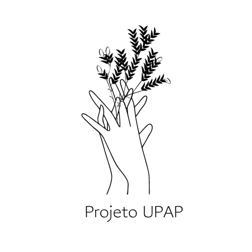

<h1 align="center">
    <br>
    <p align="center">Projeto Final - UPAP {Reprograma On15}<p>
</h1>

<p align="center">

</p>

<br><br>

## 💻 Sobre o Projeto

<br>
 <p align="justify">A API foi desenvolvida como Projeto Final do curso de Back-End da Reprograma (Turma On15) com o auxílio da professora Hanna e das monitoras, sendo pré-requisito para a conclusão do curso.
 
<p align="justify">A API tem a finalidade de informar para a população a quantidade de pacientes que estão em atendimento em cada UPA (Unidade de Pronto Atendimento), com o propósito de distribuir os pacientes por UPA, a fim de melhorar o tempo e a qualidade do atendimento e, criar um banco de dados com UPAs e pacientes.

<p align="justify">A cidade de Presidente Prudente está localizada no interior de SP e, foi escolhida para testar a API,
pois a cidade não tem nenhum sistema que apresente essa informação a população.

<p align="justify">A motivação para escolha do projeto, foi a lotação nas UPAs de Presidente Prudente / SP e a falta de informação para facilitar e distribuir melhor o atendimento. Atualmente a cidade conta com uma linha de ônibus que percorre as unidades de saúde da cidade. A prefeitura disponibiliza um site com as informações sobre atestado médico, médicos de plantão, normas etc., porém não consta em pesquisas realizadas, a informação em um banco de dados, sobre a quantidade de pacientes sendo atendidos por dia, por exemplo. 

<br><br>

## 🚀 Descrição da API UPAP

<br>

<p align="justify">O projeto é uma API REST que permite que funcionários das Unidades de Pronto Atendimento (UPA), consigam cadastrar os pacientes em atendimento, informando os dados cadastrais dos pacientes que procuram atendimento em alguma unidade de pronto atendimento da cidade. Após o atendimento, o paciente é deletado do sistema. A população tem acesso à quantidade de pacientes em atendimento em cada UPA, separadamente, podendo assim se dirigir a UPA com menos pacientes.

<p align="justify">A interface é um CRUD completo integrado com o banco de dados (Mongo DB), onde é possível listar os pacientes em cada UPA, as UPA's cadastradas, cadastrar novos pacientes, cadastrar novas UPA's, atualizar os dados e deletar os cadastros dos paciente e das UPA's. 

  


<br>

## ⚙️ Objetivos
- Criar um banco de dados com as UPA’s;
- Criar um banco de dados com os pacientes;
- Informar para a população a quantidade de pacientes que estão em atendimento em cada UPA;
- Distribuir os pacientes por UPA, a fim de melhorar o tempo e a qualidade do atendimento.

<br>

## 📚 Aprendizados
O projeto final consiste em ter uma ideia, colocar em prática e criar uma API fundamentada no CRUD, que contém os verbos: CREATE (CRIAR), READ (LER-CONSULTAR), UPDATE (ATUALIZAR) e DELETE (APAGAR). 

<br>
## 🛠️ Tecnologias utilizadas nesse projeto
<br>

Para a construção do projeto, as seguintes tecnologias foram utilizadas:
- [JavaScript](https://www.javascript.com/)
- [Git/Github](https://github.com/)
- [Node.js](https://nodejs.org/en/)
- [MongoDB](https://www.mongodb.com/)
- [Postman](https://www.postman.com/)
- [VScode](https://code.visualstudio.com/)
- [Heroku](https://dashboard.heroku.com/apps)  
### Pacotes Utilizados 
- [Express](https://expressjs.com/pt-br/)
- [Nodemon](https://nodemon.io/)
- [Dotenv](https://www.npmjs.com/package/dotenv)
- [Mongoose](https://mongoosejs.com/)
- [Cors](https://www.npmjs.com/package/cors)


<br>


## 📁 Arquitetura MVC 
```
 📁 projeto_final
   |
   |-  📁 src
   |    |
   |    |- 📁 controller
   |         |- 📑 anajacinta.js
   |         |- 📑 guanabara.js 
             |- 📑 upa.js
   |     
   |
   |    |- 📁 database
   |         |- 📑 mongoConfig.js
   |
   |       
   |    |- 📁 models
   |         |- 📑 anajacintaSchema.js
   |         |- 📑 guanabaraSchema.js  
             |- 📑 upaSchema.js
   |         
   |
   |    |- 📁 routes
   |         |- 📑 anajacintaRoutes.js 
   |         |- 📑 guanabaraRoutes.js
   |         |- 📑 upaRoutes.js
   |
   |    |- 📑 app.js
   |
   |- 📑 .env
   |- 📑 .env.example
   |- 📑 .gitignore
   |- 📑 package-lock.json
   |- 📑 package.json
   |- 📑 README.md
   |- 📑 Procfile.md
   |- 📑 server.js
```

<br>

## 🚧 Melhorias para o futuro 

<br>

* Autenticação, login e senha.
* Testes.

<br>

## 🔃 Rotas
* local: http://localhost:9000

* Heroku: https://projetoupap.herokuapp.com/anajacinta/listar/anajacinta
          https://projetoupap.herokuapp.com/guanabara/listar/guanabara
    https://projetoupap.herokuapp.com/upa/listar

        
    * Utilize o [Postman](https://www.postman.com/) para testar os endpoints da API localmente ou via Heroku.

<br>

## 🔃 Manipulação das Rotas das UPA's que disponibilizam atendimento médico:
| Método HTTP  | Endpoint                | Descrição                          |
| ------------ | ----------------------- | ---------------------------------- |
| GET          | `/upa/listar`         | Retorna todas as UPA's               |
| GET          | `/upa/listar/:id`     | Retorna uma UPA por por id           |
| POST         | `/upa/cadastrar`      | Cria/cadastra uma nova UPA           |
| PUT          | `/upa/atualizar/:id`  | Altera informações de uma UPA        |
| DELETE       | `/upa/deletar/:id`    | Deleta uma UPA por id                |

<br>

## 🔃 Manipulação das Rotas das pessoas que fizeram Login:
| Método HTTP  | Endpoint              | Descrição                                  |
| ------------ | --------------------- | ------------------------------------------ |
| GET          | `/helpers`            | Retorna todos os usuários                  |
| GET          | `/helpers/private`    | Retorna todos os dados sem restrição       |
| POST         | `/helpers/register`   | Cria um novo cadastro/login                |
| POST         | `/helpers/login `     | Faz o login                                |
| PUT          | `/helpers/update/:id` | Altera informações de um usuário           |
| DELETE       | `/helpers/delete/:id` | Deleta um usuário específico               |

<br>
## ✅ Dados para Collection Ana Jacinta e Guanabara:
- id: gerado automaticamente 
- nome: texto e obrigatório
- sobrenome: texto e obrigatório
- email: texto e obrigatório 
- celular: número e obrigatório
- whatsapp: booleano e obrigatório
- cpf: número e obrigatório 
- bairro: texto e obrigatório 
- pix: texto e obrigatório 
- termosDeUso: texto e obrigatório
- informacao: texto e obrigatório  
- criadoEm: data gerada automaticamente e obrigatório
<br>

## ✅ API deve retornar seguinte JSON:
```jsx
{
    "_id": "61b780fa0fd8f51ac598b64b",
    "name": "Henrique",
    "nickname": "Neves",
    "whatsapp": true,
    "bairro": "cordeiro",
    "termosDeUso": true,
    "informacao": "Três filhos, desempregado, sem alimentos em casa, necessitando urgente de ajuda com cestas básicas ou qualquer tipo de doação",
    "criadoEm": "2021-12-13T17:19:43.701Z",
    "__v": 0
}
```
 <br>

 ## ✅ Dados para Collection Login:
- id: gerado automaticamente 
- nome: texto e obrigatório
- sobrenome: texto e obrigatório
- cpf: número e obrigatório
- email: texto e obrigatório
- password: texto e obrigatório
- termosDeUso: texto e obrigatório
<br>

## ✅ API deve retornar seguinte JSON:
```jsx
{
    "messagem": "Pessoa cadastrada com sucesso",
    "saveUser": {
        "name": "Vitória",
        "nickname": "Leite",
        "cpf": 33355566788,
        "email": "vicsleite@gmail.com",
        "password": "$2b$10$n9jsDR1jjcN3Gpk8.EDXDeTOHwKCedTERQQyWh38jgCoZlwixFbq6",
        "termosDeUso": "false",
        "_id": "61b7a3a8a02e42b50f53a427",
        "createdAt": "2021-12-13T19:48:56.683Z",
        "updatedAt": "2021-12-13T19:48:56.683Z",
        "__v": 0
    }
}
```
<br>

## 👨‍💻 Autora
<br>

## [Dayane Oliveira](https://github.com/dayaneoli/reprograma-ProjetoUPAP)
## [LinkedIn](https://www.linkedin.com/in/dayane-oliveira-410528242/) 

<br>

## 🥰 Agradecimentos:
<p align="justify"> Primeiramente a Deus, a todos os Santos e Anjos. 
Aos meus pais e irmãos pelo apoio e compreensão. 
Agradecer também a Reprograma pela oportunidade de transformação da vida de mulheres, que é uma causa de extrema importância.
E finalmente, a todas as meninas da turma On15.

## Referências Bibliográficas:

https://mongoosejs.com/docs/api.html#query_Query-countDocuments

https://acervolima.com/funcao-de-contagem-de-mongoose/#:~:text=count()%20%C3%A9%20usada%20para,como%20uma%20consulta%20de%20contagem.&text=Par%C3%A2metros%3A%20Esta%20fun%C3%A7%C3%A3o%20aceita%20um,retorna%20o%20objeto%20de%20consulta.

https://programming-techniques.com/ask-475-add-images-to-readmemd-on-github/#:~:text=Basta%20adicionar%20uma%20etiqueta%20%3Cimg,que%20o%20servidor%20suporta%20CORS.&text=Preciso%20de%20incluir%20algumas%20imagens%20no%20meu%20ficheiro%20README.,-N%C3%A3o%20sei%20como

https://developer.mozilla.org/pt-BR/docs/Web/JavaScript

